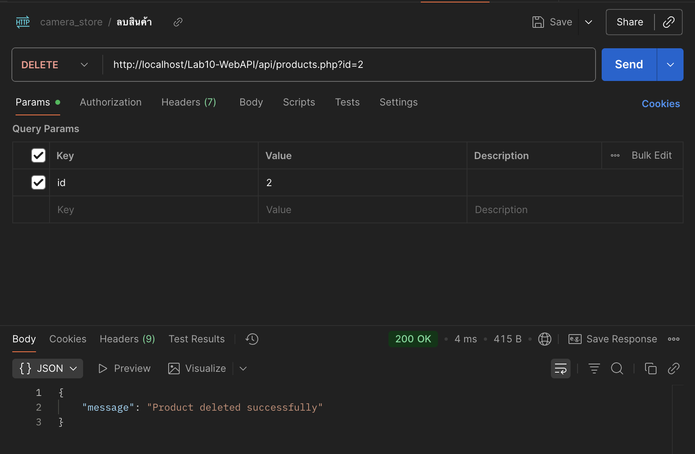

# 📸 Lab10 - Web API: Camera Store (PHP + MySQL)

โปรเจกต์นี้เป็น Web API สำหรับระบบร้านขายกล้องถ่ายรูป  
พัฒนาด้วยภาษา PHP และเชื่อมต่อกับฐานข้อมูล MySQL ผ่าน XAMPP  
สามารถใช้งาน API เพื่อ **ดูสินค้าทั้งหมด, ดูรายตัว, เพิ่ม, แก้ไข, และลบสินค้าได้**  
ข้อมูลตอบกลับอยู่ในรูปแบบ JSON

---
## 🔗 API Endpoints
```bash
GET /api/products → ดูสินค้าทั้งหมด 
GET /api/products/:id → ดูสินค้าเฉพาะ ID 
POST /api/products → เพิ่มสินค้าใหม่ 
PUT /api/products/:id → แก้ไขสินค้า 
DELETE /api/products/:id → ลบสินค้า 
```
---

##  📂 โครงสร้างไฟล์
   ```bash
#ENGSE219-LAB10-WEBAPI/
├── api/
│   └── products.php            
├── database/
│   └── camera_store(1).sql 
└── README.md 
   ```

---
## 📷 ตัวอย่างการใช้งาน API

### GET สินค้าทั้งหมด


### GET ดูสินค้าและรายการ


### POST เพิ่มสินค้า


### PUT แก้ไขสินค้า


### DELETE ลบสินค้า
